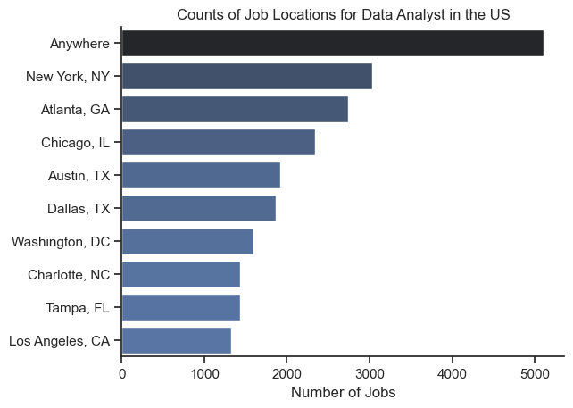
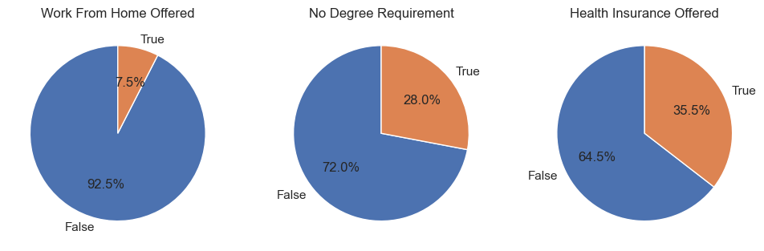
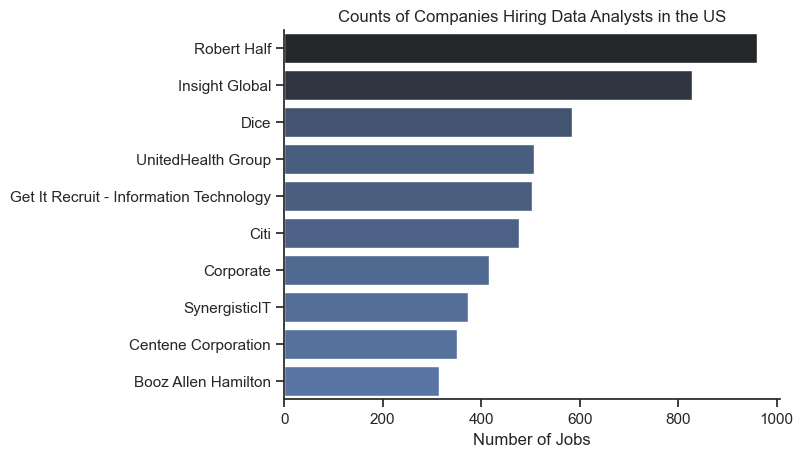
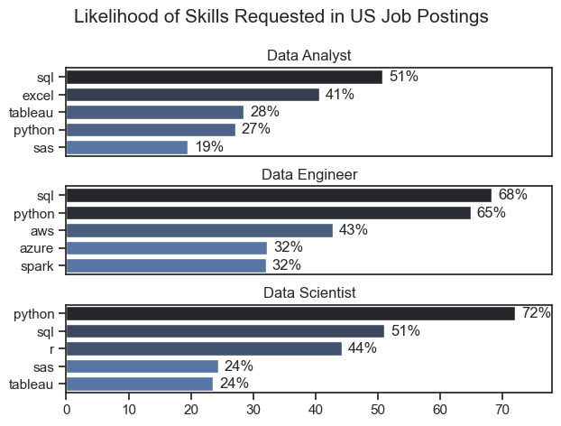
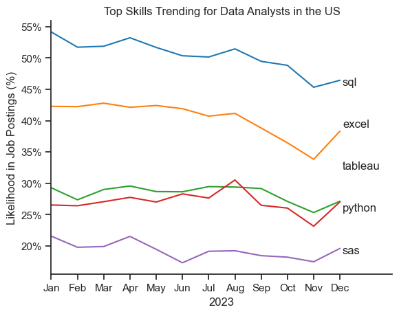
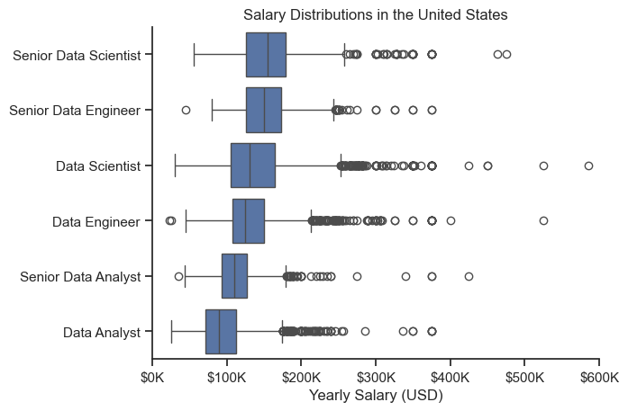
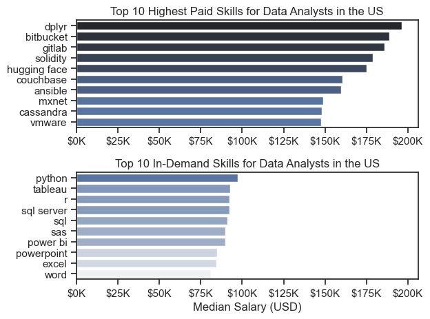
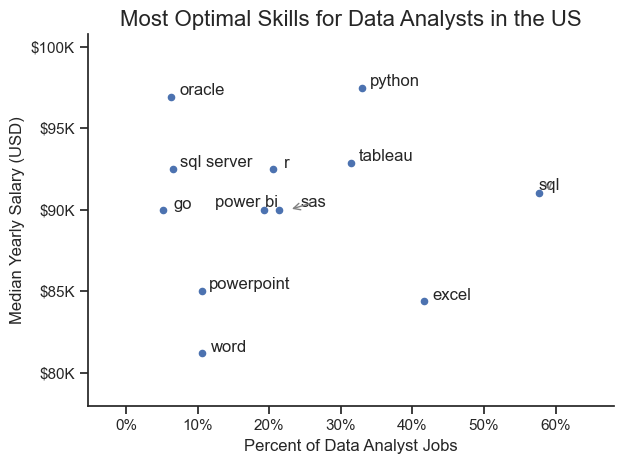
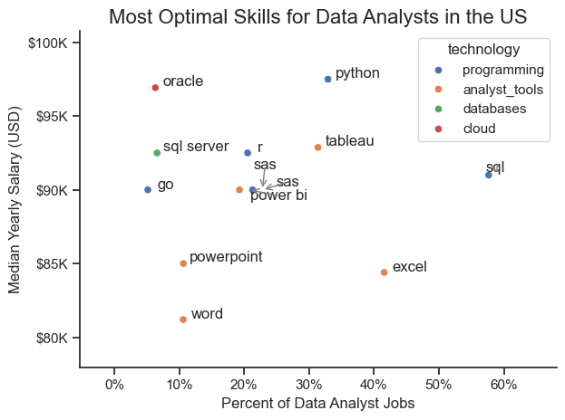

# Data Analyst Job Market Analysis (US, 2023)

---

## Overview

Welcome to my analysis of the data job market, focusing on Data Analyst roles in the US. This project was created out of a desire to navigate and explore the job market more effectively. It delves into the top-paying and in-demand skills to help find optimal job opportunities for 
Data Analysts.

The data contains detailed information on job titles, salaries, locations, and essential skills. Through a series of Python notebooks, I build a data-driven roadmap for the job seekers who want to break into or grow in data analytics.

---

## The Questions

Below are the questions I want to answer in my project:

    1. What does the US Data Analyst job market look like?
    2. What are the skills most in-demand for the top 3 most popular data roles?
    3. How are in-demand skills trending for Data Analysts?
    4. How well do jobs and skills pay for Data Analysts?
    5. What are the optimal skills for data analysts to learn? (High Demand and High Paying)

---

## Tools I Used

For my deep dive into the data analyst job market, I harnessed the power of several key tools:

- **Python**: The backbone of my analysis, allowing me to analyze the data and find critical insights.
    - **Pandas Library**: The Python Library used to load, filter, group, transform and analyze the data.
    - **Matplotlib Library**: The library I used to visualize my data.
    - **Seaborn Library**: The library I used to create more advanced visuals.
- **Jupyter Notebooks**: The tool I used to run my Python scripts which let me easily include my notes and analysis.
- **Visual Studio Code**: My go-to for executing my Python scripts.
- **Hugging Face:** Dataset hosting for the job postings data.
- **Git & GitHub**: Essential for version control and sharing my Python code and analysis, ensuring collaboration and project tracking.

---

## Data Preparation and Cleanup

This section outlines the steps taken to prepare the data for analysis, ensuring accuracy and usability.

### Import & Clean Up Data

I start by importing necessary libraries and loading the dataset, followed by initial data cleaning tasks to ensure data quality.

```python
# Importing Libraries

import ast
import pandas as pd
import seaborn as sns
import matplotlib.pyplot as plt
from datasets import load_dataset

# Loading data
dataset = load_dataset('lukebarousse/data_jobs')
df = dataset['train'].to_pandas()

# Data Cleanup
df['job_posted_date'] = pd.to_datetime(df['job_posted_date'])
df['job_skills'] = df['job_skills'].apply(lambda x: ast.literal_eval(x) if pd.notna(x) else x)

```


### Filter US Jobs

To focus my analysis on the U.S. job market, I apply filters to the dataset, narrowing down to roles based in the United States.

```python
df_US = df[df['job_country'] == 'United States']

```

---

## The Analysis

Each jupyter notebook for this project aimed at investigating specific aspects of the data job market. Here is how I approached each question:

---

### 1. What does the US Data Analyst job market look like?

Before answering specific questions, this notebook maps out the landscape of US Data Analyst postings - where jobs are located, how many offer remote opportunities, and which companies hire the most.

View my notebook with detailed steps here: [1_EDA_Intro](1_EDA_Intro.ipynb)

#### Visualize Data

```python
df_plot =df_DA_US['job_location'].value_counts().head(10).to_frame()

sns.set_theme(style='ticks')
sns.barplot(data = df_plot, x='count', y = 'job_location', hue ='count', palette = 'dark:b_r', legend = False)
sns.despine()
plt.title('Counts of Job Locations for Data Analyst in the US')
plt.xlabel('Number of Jobs')
plt.ylabel('')
plt.show()

```

#### Results







#### Insights

- **`Anywhere` (remote) is by far the most common job location label** in the US, followed by New York and Atlanta. 
- However, looking at `job_work_from_home` field specifically shows that only **7.5% of postings explicitly advertise remote work**. This means most `Anywhere` listings represents roles with flexible or multiple locations rather than fully remote positions - an important distinction for job seekers planning their search.
- **28% of postings do not mention a degree requirement**, meaning around 3 in 4 postings still require a formal qualification. Not mentioning a degree does not guarantee that it is not needed but signals more flexibility in hiring process. 
- **Nearly 36% of postings include health insurance benefits**, which is a meaningful consideration when comparing job offers.
- **Robert Half, Insight Global and Dice are top 3 hiring companies** - all staffing and recruitment agencies. This reveals how common contract and temporary DA placements are in the market, and many open roles are sourced through third-party recruiters rather than directly by employers.

---

### 2. What are the most demanded skills for the top 3 most popular data roles?

To find the most demanded skills for the top 3 most popular data roles in the US, I identified the most popular roles by job posting volume, then calculated what percentage of postings for each role required each skill. This query highlights the most popular job titles and their top skills, showing which skills I should pay attention to depending on the role I am targeting.

View my notebook with detailed steps here: [2_Skills_Demand](2_Skill_Demand.ipynb)

#### Visualize Data

```python

fig, ax = plt.subplots(len(job_titles),1)

sns.set_theme(style='ticks')

for i, job_title in enumerate(job_titles):
    df_plot = df_skills_perc[df_skills_perc['job_title_short']==job_title].head()
    
    sns.barplot(data=df_plot,x='skill_percent',y='job_skills',ax=ax[i],hue='skill_count',palette='dark:b_r')

plt.show()
```

#### Results

     
*Bar graph visualizing the likelihood of skills in top 3 data roles.*

#### Insights

- **SQL is the most important skill for Data Analysts (51%) and Data Engineers (68%)**, the single non-negotiable baseline skill across most data roles. 
- **Python is the most sought-after skill for Data Scientists**, appearing in 72% of job postings, and is also critical for Data Engineers (65%).
- **Data Analysts lean on BI tools** - Excel (41%), Tableau (28%), reflecting the reporting and communication focus of the role.
- **Data Engineers require more specialized cloud and infrastructure skills** (AWS, Azure, Spark) compared to Data Analysts and Data Scientists who are expected to be proficient in more general data management and analysis tools (Excel, Tableau).
- **Python is a versatile skill**, highly demanded across all three roles, but most prominent for Data Scientists and Data Engineers.

--- 

### 3. How are in-demand skills trending for Data Analysts?

To find how skills trended throughout 2023, I filtered to data analyst positions, grouped the skills by the month of the job postings, and calculated each skill's likelihood of appearing as a percentage of that month's total postings. This provides me the top 5 skills of data analysts by month, showing how popular skills were throughout 2023.

View my notebook with detailed steps here: [3_Skills_Trend](3_Skills_Trend.ipynb)

#### Visualize Data

```python
from matplotlib.ticker import PercentFormatter

df_plot = df_DA_US_percent.iloc[:,:5]
sns.lineplot(data = df_plot, dashes = False, palette = 'tab10')

ax.yaxis.set_major_formatter(PercentFormatter(decimals=0))

plt.show()
```
#### Results

    
*Line graph visualizing the monthly likelihood of the top 5 DA skills appearing in US job postings throughout 2023.*

#### Insights

- **SQL remains the most consistently demanded skill throughout the year**, holding above 45% across all months, though it shows a gradual downward trend toward year end.
- **Excel is the second most demanded skill** and remains relatively stable throughout the year before a sharp dip in November, which reflects the seasonal slowdown rather than a real shift in demand.
- **Both Python and Tableau show relatively stable demand** throughout the year with some fluctuations but remain essential skills for data analysts. 
- **SAS shows the most consistent decline** across the year, suggesting it is gradually being replaced by newer tools in some organizations.
- **November dip across all skills** reflects fewer job postings during the slower hiring period - not a structural change in which skills are valued.

---

### 4. How well do jobs and skills pay for Data Analysts?

To identify the highest-paying roles and skills, I looked at the median salary across the top 6 US data roles, then zoomed into Data Analyst specifically to compare the highest-paid skills against the most in-demand skills.

View my notebook with detailed steps here: [4_Salary_Analysis](4_Salary_Analysis.ipynb)

#### Visualize Data

```python
sns.boxplot(data = df_US_top6, x = 'salary_year_avg', y = 'job_title_short', order = order_list)

ax.xaxis.set_major_formatter(plt.FuncFormatter(lambda x, pos: f'${int(x/1000)}K'))

plt.show()
```

#### Results

               
*Box plot visualizing the salary distributions for the top 6 data roles.*

#### Insights:

- There's a significant variation in salary ranges across roles. 
- **Senior Data Scientist positions** tend to have the highest salary potential, with outliers reaching up to $600K, indicating the high value placed on advanced data skills and experience in the industry.
- **Senior Data Engineer and Senior Data Scientist roles** show a considerable number of outliers on the higher end of the salary spectrum, suggesting that exceptional skills or circumstances can lead to high pay in these roles. 
- In contrast, **Data Analyst roles** demonstrate more consistency in salary, with fewer outliers.
- **The median salaries increase with the seniority and specialization of the roles** - Senior roles not only have higher median salaries but also greater variance, reflecting more varied responsibilities and compensation structures.
- **Data Engineers earn significantly more than Data Analysts** at the same seniority level, indicating the higher technical barrier to entry.

#### Highest Paid & Most Demanded Skills for Data Analysts

Next, I narrowed my analysis and focused only on Data Analyst roles. I looked at the top 10 highest-paid skills and the 10 most in-demand skills. I used two bar charts to showcase these.

#### Visualize Data

```python
fig, ax = plt.subplots(2,1)

# Top 10 Highest Paid Skills for Data Analysts in the US

sns.barplot(data = df_DA_top_pay, x = 'median', y = df_DA_top_pay.index, ax = ax[0], hue = 'median', palette = 'dark:b_r')

# Top 10 Most In-Demand Skills for Data Analysts in the US

sns.barplot(data = df_DA_skills, x = 'median', y = df_DA_skills.index, ax = ax[1], hue = 'median', palette = 'light:b')

plt.show()
```

#### Results

           
*Two separate bar graphs visualizing the highest paid skills and most in-demand skills for data analysts in the US.*

#### Insights

- **The highest-paid skills:** The top graph shows specialized technical skills like dplyr, Bitbucket, and Gitlab are associated with higher salaries, some reaching up to $200K, suggesting that advanced technical proficiency can increase earning potential.
- **The most in-demand skills:** The bottom graph highlights that foundational skills like Excel, PowerPoint, and SQL are the most in-demand, even though they may not offer the highest salaries. This demonstrates the importance of these core skills for employability in data analysis roles.
- **There is zero overlap** between the two list - no skill appears simultaneously in the top 10 for both pay and demand. The skills that get you hired are not the same skills that make you the highest paid. Data analysts aiming to maximize their career potential should consider developing a diverse skill set that includes both high-paying specialized skills and widely demanded foundational skills.

### 5. What are the most optimal skills to learn for Data Analysts?

To identify the most optimal skills to learn (the ones that are the highest paid and highest in demand), I calculated the percent of skill demand and the median salary of these skills. 

View my notebook with detailed steps here: [5_Optimal_Skills](5_Optimal_Skills.ipynb)

#### Visualize Data

```python
from adjustText import adjust_text
import matplotlib.pyplot as plt

df_DA_skills_high_demand.plot(kind='scatter',x = 'skill_percent', y = 'median_salary')

plt.show()
```

#### Results

            
*A scatter plot visualizing the most optimal skills (high paying & high demand) for Data Analysts in the US.*

#### How to read this chart

- **X-axis** - How often this skill appears across DA job postings (demand)
- **Y-axis** - The median yearly salary for jobs requiring this skill (pay) 
- **Top-right** - High demand and high salary (most optimal skills to learn) 
- **Top-left** - High salary but rare (niche, specialized skills )
- **Bottom-right** - Very common but lower salary (foundational skills) 

#### Insights

- **Python sits in the top-right quadrant** with 33% demand and the highest median salary ($97K) of any demanded skill. It is the strongest skill to learn for maximizing both job opportunities and earning potential.
- **SQL is the most demanded skill** at 57% of all job postings but sits at a lower median salary ($91K) - essential to have but limits its salary power.
- **Tableau and Power BI** are towards the higher end of the salary spectrum while also being fairly common in job listings, indicating that proficiency in these tools can lead to good opportunities in Data Analytics.
- **Excel and PowerPoint** are more commonly required skills which have a large presence in job listings but lower median salaries compared to specialized skills like Python and Tableau, which not only have higher salaries but are also moderately prevalent in job listings.
- **Oracle** appears to have the highest median salary of nearly $97K, despite being less common in job postings. This suggests a high value placed on specialized database skills within the data analyst profession.

### Visualizing Different Technologies

Let's visualize the different technologies as well in the graph. We'll add color labels based on the technology (e.g., {Programming: Python})

#### Visualize Data

```python
sns.scatterplot(data = df_plot,x = 'skill_percent', y = 'median_salary', hue = 'technology')

from matplotlib.ticker import PercentFormatter
ax = plt.gca()
ax.yaxis.set_major_formatter(plt.FuncFormatter(lambda y, pos: f'${int(y/1000)}K'))
ax.xaxis.set_major_formatter(PercentFormatter(decimals=0))

plt.show()
```

#### Results

                
*A scatter plot visualizing the most optimal skills (high paying & high demand) for data analysts in the US with color labels for technology.*

#### Insights
- The scatter plot shows that most of **the programming skills (colored blue)** tend to cluster at higher salary levels compared to other categories, indicating that programming expertise might offer greater salary benefits within the data analytics field.
- **The cloud (colored red) and database skills (colored green)**, such as Oracle and SQL Server, are associated with some of the highest salaries among data analyst tools. This indicates a significant demand and valuation for data management and manipulation expertise in the industry.
- **Analyst tools (colored orange)**, including Tableau and Power BI, are prevalent in job postings and offer competitive salaries, showing that visualization and data analysis software are crucial for current data roles. This category not only has good salaries but is also versatile across different types of data roles.

---

## What I learned

Throughout this project, I deepened my understanding of the data analyst job market and enhanced my technical skills in Python, especially in data manipulation and visualization.
 
Here are a few specific things I learned:
- **Advanced Python Usage**: Utilizing libraries such as Pandas for data manipulation, Seaborn and Matplotlib for data visualization, and other libraries helped me perform complex data analysis tasks more efficiently.
- **Data Cleaning Importance**: I learned that thorough data cleaning and preparation are crucial before any analysis can be conducted, ensuring the accuracy of insights derived from the data.
- **Strategic Skill Analysis**: The project emphasized the importance of aligning one's skills with market demand. Understanding the relationship between skill demand, salary, and job availability allows for more strategic career planning in the tech industry.

---

## Recommendations for Job Seekers

Based on the full analysis, here is the practical learning roadmap depending on your goal:

### If you are starting out - prioritize getting hired first

Focus on the skills that appear in the majority of the postings. Without these, you are unlikely to pass initial screening regardless of other qualifications.

1. **SQL** - appears in 51% of DA postings, non-negotiable skill for any data role.
2. **Excel** - appears in 41% of postings, it is still the dominant tool in most business environments. 
3. **Tableau** - appears in 28% of postings, it is the most common visualization tool for Data Analysts.

### Once employed - build the diverse skill set toward higher salary

Once you have a job, shift focus to skills that increase your earning potential.

1. **Python** - the most impactful skill to learn with strong demand (33%) and the highest median salary ($97K). It also opens a door to Data Engineer and Data Science roles.
2. **Power BI** - the growing demand skill in the Microsoft ecosystem with higher salary than Excel and PowerPoint.

### The Key Insight From This Project

The analyst tools (SQL, Excel) that get you hired and the programming and cloud skills (Python, Oracle) that make you highest paid are different. A successful DA career requires both foundational skills to enter the job market, and more technical and specialized skills to grow within it.

---

## Challenges I Faced

This project was not without its challenges, but it provided good learning opportunities:
- **Data Inconsistencies:** Handling missing or inconsistent data entries requires careful consideration and thorough data-cleaning techniques to ensure the integrity of the analysis. 
- **Complex Data Visualization:** Designing effective visual representations of complex datasets was challenging but critical for conveying insights clearly and compellingly.
- **Balancing Breadth and Depth:** Deciding how deeply to dive into each analysis while maintaining a broad overview of the data landscape required constant balancing to ensure comprehensive coverage without getting lost in details.

---

## Conclusion

This exploration into the data analyst job market has been highly informative, highlighting the critical skills and market dynamics that shape this evolving field. The insights provide actionable guidance for anyone looking to advance their career in Data Analytics. As the market continues to evolve, ongoing analysis will be essential to stay ahead in Data Analytics. This project is a good foundation for future explorations and underscores the importance of continuous learning and adaptation in the data field.
